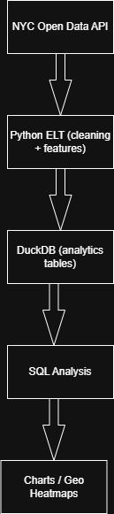
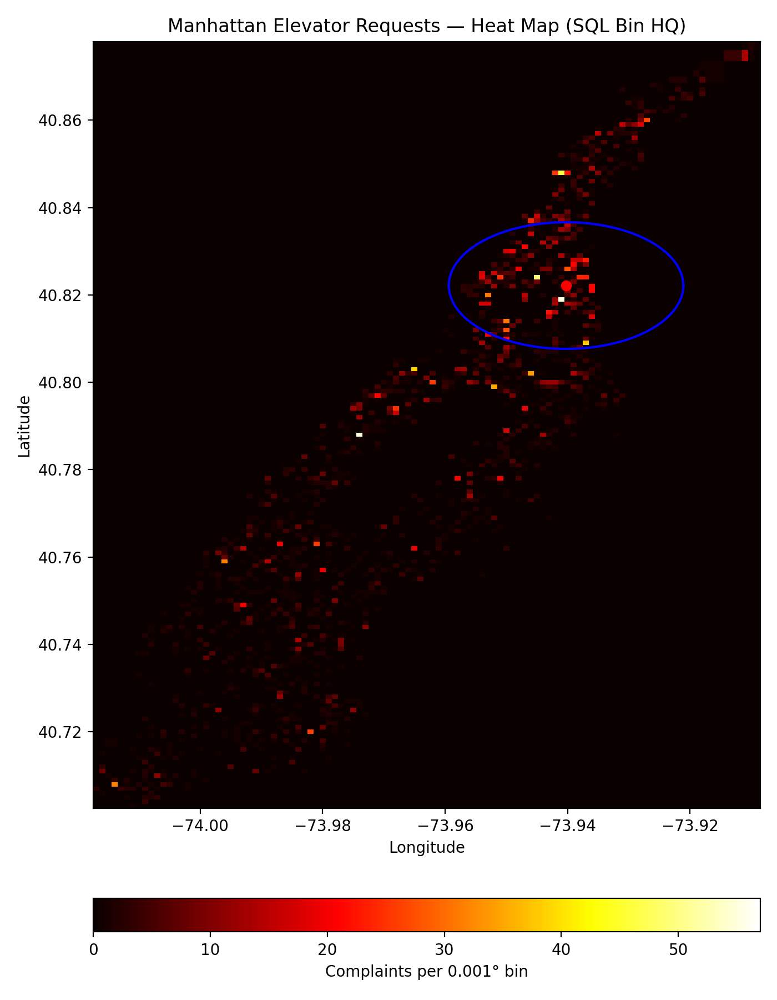
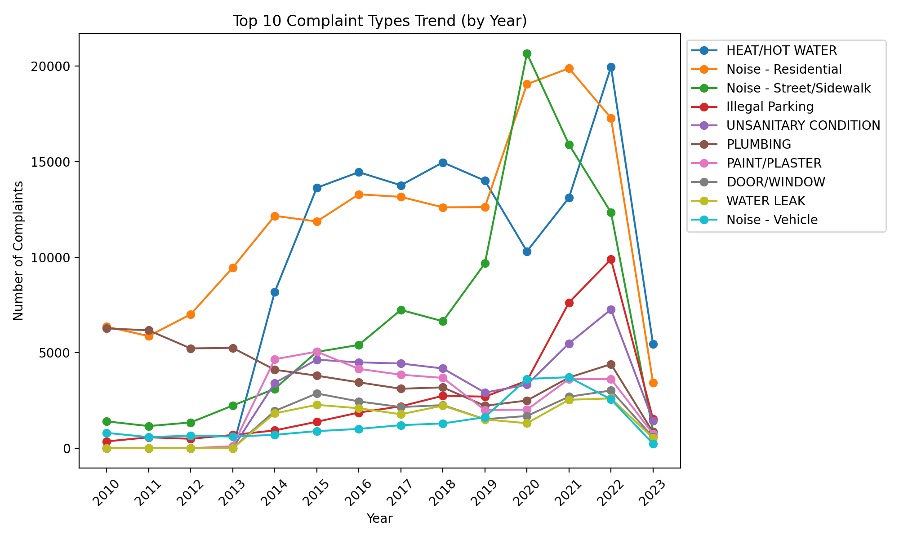

# NYC Elevator ELT Pipeline and Complaint Analysis


# Project Overview
This project implements a reproducible ELT pipeline that ingests municipal service complaint data from a public API, cleans and models the data, and produces analytics-ready datasets for business and geospatial analysis.
Although demonstrated using NYC elevator complaints, the pipeline is city-agnostic and can be reused for other municipal open-data platforms with minimal configuration changes.

---

## Business Context
Building maintenance companies in NYC need to identify high-density complaint areas to optimize service coverage and reduce response times. This analysis provides data-driven insights for strategic placement of repair hubs.

Key Questions
- What is the total elevator complaint in 2024?
- What is the average number of days taken to resolve elevator complaints in 2024?
- What is the total elevator complaint per borough and percentage?
- What is the average time taken to update the complaint created?
- What is the yearly & monthly & quarterly trends in elevator complaints?
- Which boroughs/ZIP codes have the most complaints?
- How long it takes to resolve complaints?
- What are the other highly reported service requests for expansion opportunities for the business?
- What is a suitable place/location for the headquarter (HQ)?

Answers to these business questions are provided in the analytics folder in this repository.

---

## Tech Stack
- Python
- DuckDB
- SQL
- Socrata API / SODA
- Pandas, NumPy, Matplotlib
- Docker

---


## Pipeline Steps
1. Fetch elevator complaints from NYC Open Data using API.
2. Normalize and clean 50+ messy system-generated columns.
3. Store results in DuckDB.
4. Compute feature: `closed_in_days` (days to resolve a complaint)
5. Export data for analytics & geospatial work.

---

## Pipeline Architecture
Data Flow:
NYC Open Data API
→ Python ELT (data cleaning, feature engineering, validation)
→ DuckDB (analytics tables)
→ SQL analysis
→ Visualizations & geospatial insights

 

---

## Data Validation & Quality Checks
Basic data quality checks are applied during the ELT process to ensure analytical correctness:

- Validated non-null complaint creation and closure timestamps.

- Ensured complaint closure dates occur after creation dates.

- Verified non-negative resolution time calculations.

- Confirmed successful ingestion with minimum row count checks.

These validations make the pipeline suitable for automated execution and future CI integration.

---

## 📁 Project Structure
```
nyc-elevator-etl/
│
├── pipeline/
│   ├── __init__.py
│   ├── etl.py
│   ├── export_parquet.py
│   └── geo_analysis.py
│
├── sql/
│   ├── avg_closing_days.sql
│   ├── complaints_by_borough.sql
│   ├── complaints_by_month.sql
│   ├── complaints_by_quarter.sql
│   ├── resolution_time_hours.sql
│   └── total_complaints.sql
│
├── insights/
│   └── elevator_complaint_insights.md
│
├── docker/
│   └── Dockerfile
├── docker-compose.yml
├── .dockerignore
│
├── data/                # ignored by git
├── .env                 # ignored by git
├── .gitignore
├── requirements.txt
└── README.md
```

---

## Run Locally
```bash
# Install dependencies
pip install -r requirements.txt

# Run the ETL pipeline
python pipeline/etl.py

# Export to Parquet
python pipeline/export_parquet.py

# Generate geospatial analysis
python pipeline/geo_analysis.py
```

## 🐳 Run with Docker
```bash
# Build the image
docker build -t elevator-etl ./docker

# Run the container
docker run --env-file .env elevator-etl
```

## 📊 Outputs

After running the pipeline, you'll find:

- **`data/clean_elevator_2024.csv`** — Cleaned dataset
- **`data/clean_elevator_2024.parquet`** — Parquet format for analytics
- **`manhattan_elevator_heatmap.png`** — Geospatial heatmap visualization and map output to locate the head quarter
- **`complaint_trends_top10.png`** — Line chart of the trend of other complaint types for other service request opportunities
- **`complaint_analysis_by_year.csv`** — Yearly trend analysis and visualization of top ten complaints

---

## 📝 Insights & Analysis

🌍 Geographic Insights:
The analysis shows a hotspot at Upper Manhattan/Bronx border with 57 complaints in a single bin which is perfect for HQ placement!
 

Yearly Trend Analysis:
An analysis of the trend of complaint across various categories led to the recognition of the top 10 complaint types between the year 2010 to year 2023. This is to present the business with alternative service request opportunities that can be explored or combined with elevator service. The analysis revealed the huge potential that lies in creating an HVAC service in the area due to the high
heat/hot water complaints. This is presented in the line chart  

Full information about this insight is documented in:

- **`analytics/elevator_complaint_insights.md`** — Complaint trend analysis and strategic recommendations for stakeholders.


## Scalability & Reusability
The pipeline was designed with scalability and reuse in mind:

- API endpoint and credentials configured via environment variables.

- Modular pipeline structure separating ingestion, transformation, and analytics.

- DuckDB used for fast, low-overhead analytical queries on large datasets.

- SQL-based aggregations for efficient computation and reduced memory usage.

- Containerized with Docker for consistent local and cloud execution.

This design allows the pipeline to be adapted to other city-level datasets across Europe and beyond.

---

## Performance
- Records processed: 22,507 complaints (2024.)

- End-to-end runtime: ~2 minutes on a local machine.

- Storage formats: CSV (cleaned) and Parquet (analytics-ready).

---

## Future Improvements
- Add automated CI pipeline to run validation checks on each commit.

- Extend pipeline to support incremental loads and historical backfills.

- Deploy DuckDB analytics layer to cloud storage (S3-compatible).